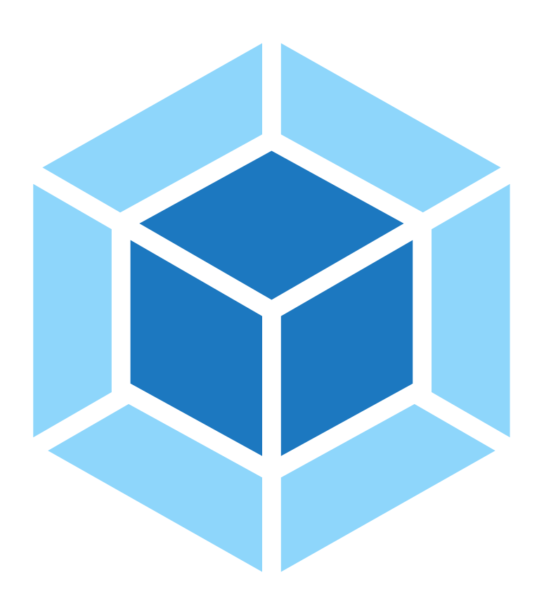

# dev-logos.svg
logos: angular, css, firebase, github, google, html, ionic, js, material, nestjs, nodejs, npm, nx, pwa, react, rxjs, sourcerer, ts, web-components, webpack

                   

## Não encontrou a logo que queria? se você sentiu falta, alguém pode sentir também.
O que acha de encontrar e nos enviar? seria de grande ajuda! Obrigado desde já. : )
